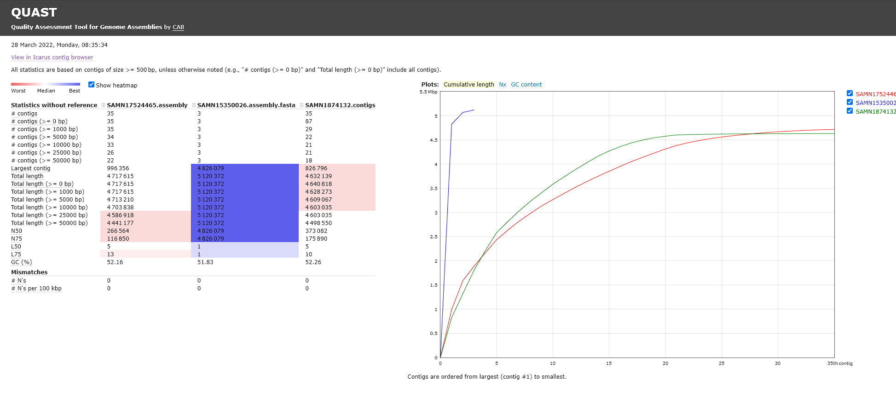
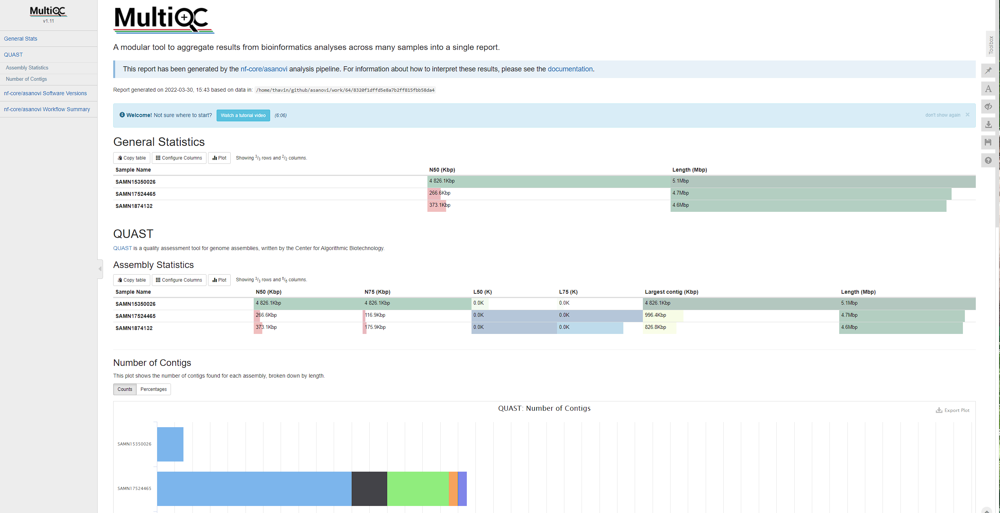

# Asanovi

[](https://www.nextflow.io/)
[](https://docs.conda.io/en/latest/)
[](https://www.docker.com/)
[](https://sylabs.io/docs/)


**Asanovi** is a bioinformatics pipeline for bacterial de novo genome assembly. The pipeline accepts both 2nd and 3rd generation sequencing reads as an input. In addition to assembling the reads, the pipeline also evaluates the quality of the assembly results and summarises them in the single html report.  

The pipeline is built using [Nextflow](https://www.nextflow.io), a workflow tool to run tasks across multiple compute infrastructures in a very portable manner. It uses Docker/Singularity containers making installation trivial and results highly reproducible. The [Nextflow DSL2](https://www.nextflow.io/docs/latest/dsl2.html) implementation of this pipeline uses one container per process which makes it much easier to maintain and update software dependencies. 

## Pipeline summary

### 1. Assembly
Depending on the input provided to the pipeline, the input will be passed to the different processes to perform the assembly. 

#### Short reads assembly
For the input samples provided with only short reads, reads assembly will be performed using [`Spades`](https://github.com/ablab/spades).

#### Long reads assembly
For the input samples provided with only long-reads from either Pacbio or Nanopore platforms,  reads assembly will be performed using  [`Flye`](https://github.com/fenderglass/Flye)

#### Hybrid assembly
If the input sample is provided with both short-reads and long-reads, the pipeline will perform the read assembly with the long-reads first using [`Flye`](https://github.com/fenderglass/Flye). The short-reads will be used to map with the result assembly contig(s) using [`Minimap2`](https://github.com/lh3/minimap2)and [`Samtools`](https://github.com/samtools/samtools). Then use the alignment file to correct the bases of the assembly contig(s) with [`Pilon`](https://github.com/broadinstitute/pilon).

### 2. Evaluate Assembly Quality 
Once the assembly process is finished, The quality of assembly results will be evaluated using [`Quast`](https://github.com/ablab/quast).

### 3. Collect and Report Quast results
Then the single report from the quast results is created by [`MultiQC`](https://github.com/ewels/MultiQC).

## Quick Start

1. Install [`Nextflow`](https://www.nextflow.io/docs/latest/getstarted.html#installation) (`>=21.04.0`)

2. Install [`Docker`](https://docs.docker.com/engine/installation/), or [`Singularity`](https://www.sylabs.io/guides/3.0/user-guide/) for full pipeline reproducibility _(please only use [`Conda`](https://conda.io/miniconda.html) as a last resort; see [docs](https://nf-co.re/usage/configuration#basic-configuration-profiles))_

3. Start the pipeline from github repository

    ```console
    nextflow run thavinb/asanovi -profile <docker/singularity/conda> --input samplesheet.csv --outdir Asanovi_output
	```
	or  run locally with:
	```console
		git clone https://github.com/thavinb/asanovi.git
		cd asanovi 
		nextflow run main.nf -profile <docker/singularity/conda> --input samplesheet.csv --outdir Asanovi_output
	```
	> * For the details on the input samplesheet please see Samplesheet input in the [usage](https://github.com/thavinb/asanovi/usage) section.
	> * If one wants to run the pipeline without using the container please see the note in [usage](https://github.com/thavinb/asanovi/usage) below.

## Usage 
### Main pipeline parameters

| Parameter         | Description                                                                                                                                                                            |
|----------------|----------------------------------------------------------------------------------------------------------------------------------------------------------------------------------------|
| `--input`       | The comma-seperated samplesheet contains the information of the samples to be processed in the pipeline. |
| `--outdir`     | Directory to publish the results of the pipeline. Default: `asanovi_output`|
| `--custom_config`        | Path to user-specified config file. If given, this will override the default config define in `modules.config`. Default: `null`|

### Samplesheet input

The pipeline requires a comma-seperated samplesheet as an input. The samplesheet need to contain the information of the samples used in the pipeline. It has to be in the following format with 5 columns and a header row as in the example below:   

```console
sample,platform,fastq,fastq_1,fastq_2
A1,nano,A1_LR.fastq.gz,A1_1.fastq.gz,A1_2.fastq.gz
A2,pacbio,A2_LR.fastq.gz,,
A3,,,A3_1.fastq.gz,A3_2.fastq.gz
```
Depending on the type of fastq file given in the samplesheet, the samples will be assembly through different sets of program. the pipeline will auto-detect the assembly method for the samples base on the fastq file given `fastq`, `fastq_1`, and `fastq_2` columns. 
* If the path of fastq file is given only in `fastq_1` and `fastq_2`, then assembly will perform through short read assembly workflow. 
* If the path of fastq file is given only in `fastq`, then assembly will perform through long read assembly workflow.
* If the path of fastq file is given in `fastq`, `fastq_1`, and `fastq_2`, then assembly will perform through hybrid assembly workflow.

The definition of each column is in the table below:

| Column         | Description                                                                                                                                                                            |
|----------------|----------------------------------------------------------------------------------------------------------------------------------------------------------------------------------------|
| `sample`       | Custom sample name. Spaces in sample names are automatically converted to underscores (`_`). |
| `platform`     | Platform of long reads in the `fastq` column. The value can only be `pacbio` or `nano`. Leave blank if no long reads FastQ file is given in the `fastq` column.|
| `fastq`        | Full path to FastQ file for Pacbio or Nanopore long reads. File has to be gzipped and have the extension ".fastq.gz" or ".fq.gz".|
| `fastq_1`      | Full path to FastQ file for Illumina short reads 1. File has to be gzipped and have the extension ".fastq.gz" or ".fq.gz".                                                             |
| `fastq_2`      | Full path to FastQ file for Illumina short reads 2. File has to be gzipped and have the extension ".fastq.gz" or ".fq.gz".                                                             | 
An [example samplesheet](:/ee4dea31a27249a794893b2555233cfd) has been provided with the pipeline.

### Run asanovi without container

Although **asanovi** pipeline is preferably used with the docker or singularity. One can run the pipeline without the container by running without  `-profile` option.
```console
nextflow run thavinb/asanovi --input samplesheet.csv --outdir Asanovi_output
```
However, All programs used in the pipeline must be able to call locally **by name** through user's PATH. For the full list of all the programs used in the pipeline please see the Pipeline tools section in [`CITATIONS.md`](:/93d0c0dcd8164818ab33e98586f829fd).

## Output

If  `--outdir` is not provided in the run command, the pipeline will create directory name `asanovi_output` by default to put all of the pipeline output into it. The directories listed below will be created in the output directory after the pipeline has finished. All paths are relative to the top-level results directory.

### Assembly output
The assembly results are varies on the program used to do the assembly. The results are put in its `sample` name subdirectory under either  `shortread`, `longread`, or `hybrid` directory depending on the type of the input.  

<details markdown="1">
<summary>Output files</summary>

* `shortread/`
	* `{sample_name}/`
		* `{sample_name}.scaffolds.fa.gz` : Contains resulting scaffolds (recommended for use as resulting sequences).
		* `{sample_name}.contigs.fa.gz`  : Contains resulting contigs.
		* `{sample_name}.assembly.gfa.gz` : Contains `Spades` assembly graph and scaffolds paths in GFA 1.0 format.
		* `{sample_name}.spades.log` : `Spades` assembly log.
* `longread/`
	* `{sample_name}/`
		* `{sample_name}.assembly.fasta.gz` :  Final assembly. Contains contigs and possibly scaffolds. 
		* `{sample_name}.assembly_graph.gfa.gz`: Final repeat graph
		* `{sample_name}.assembly_graph.gv`: Final repeat graph
		* `{sample_name}.assembly_info.txt`: Extra information about contigs.
* `hybrid/`
	* `{sample_name}/`
		* `flye/`
			* `{sample_name}.assembly.fasta.gz`: Final assembly. Contains contigs and possibly scaffolds. 
			* `{sample_name}.assembly_graph.gfa.gz`: Final repeat graph
			* `{sample_name}.assembly_graph.gv`: Final repeat graph
			* `{sample_name}.assembly_info.txt`: Extra information about contigs.
		* `pilon_corrected/`
			* `{sample_name}.assembly.fasta`: `Flye` 's assembly result corrected by `Pilon`'.
			* 
</details>

### Quast and MultiQC
 `Quast` evaluates the quality of the assembly results and outputs the single tsv report and interactive visualizer [`Icarus`](https://github.com/ablab/quast) of the assembly results. `MultiQC` then summarise the statistic of all samples from `Quast`'s report into a single interactive html report. The results from both programs are put in the `Asanovi_report` directory. 
 
<details markdown="1">
<summary>Output files</summary>

 * `Asanovi_report/`
	* `quast/`
		* `basic_stats/`: Directory containing static images from the report in various formats.
		* `report.tsv` :  Report in tsv format.
		* `report.html` :  Report in tsv format.
		* `report.pdf` :  Report in tsv format.
		* `report.txt` :  Report in tsv format.
		* `icarus_viewers/`: Directory containing intermediate files use in icarus viewer.
		* `icarus.html` :  Assembly interactive visualizer in html.
		* `quast.log`: Log from running `Quast`
		
	* `multiqc_data/`: Directory containing parsed statistics from the different tools used in the pipeline.
	* `multiqc_plots/`: Directory containing static images from the report in various formats.
	* `multiqc_report.html`: `MultiQC` html report.	
	* 
</details>






### Pipeline information
Nextflow provides excellent functionality for generating various reports relevant to the running and execution of the pipeline. This will allow you to troubleshoot errors with the running of the pipeline, and also provide you with other information such as launch commands, run times, and resource usage.

<details markdown="1">
<summary>Output files</summary>

* `pipeline_info/`
Reports generated by Nextflow: `execution_report.html`, `execution_timeline.html`, `execution_trace.txt` and `pipeline_dag.dot`/`pipeline_dag.svg`.
Reports generated by the pipeline: `pipeline_report.html`, `pipeline_report.txt`, and `software_versions.tsv`.
Reformatted samplesheet files used as input to the pipeline: `samplesheet.valid.csv`.

</details>

## Documentation

For extensive detail on the pipeline usage and how to customize the pipeline configuration please see the  [usage](https://nf-co.re/asanovi/usage). The file is modified from the auto-generated `nf-core` template. 


## Citations

An extensive list of references for the tools used by the pipeline can be found in the [`CITATIONS.md`](:/93d0c0dcd8164818ab33e98586f829fd) file.
This pipeline is using the `nf-core` template.
